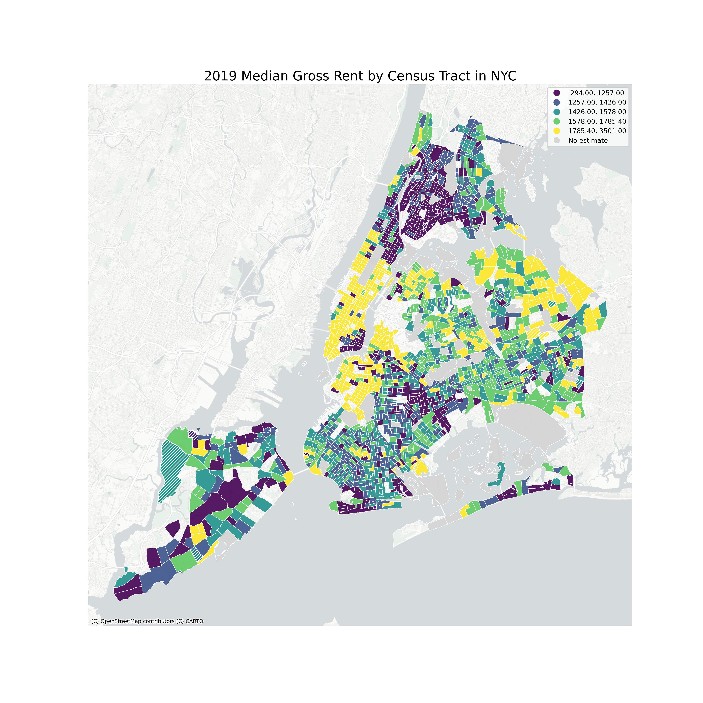

Student Name: Rutuja Vartak   
Class: SEMINAR PUBLIC INFORMATICS - Command Line Geographic Information System

The datasets used to create the maps were sourced from the Census, City of New York's open data portal, specifically the Housing Maintenance Code Violations and New York Homes and Community Renewal Asset Map. The datasets include information on median gross rent by census tract and public housing portfolios with HPD violation data for New York City. The data on violations are prepared and maintained by the Department of Housing Preservation and Development (HPD) and are updated daily. In contrast, the housing portfolios are updated each quarter.

The total number of violations is 8.3 million; however, I have filtered for hazardous open violations, which has been reduced to 1.2 million. To create the maps, I performed a table join between the housing portfolio and violation datasets, allowing me to visualize the geographical distribution of violations within different housing portfolios. Properties with no active hazardous violations show nan. After obtaining the violation points for the properties, I performed a point-to-polygon spatial join and created a pivot table to determine the number of violations per borough.

During the process, I addressed data quality issues while joining violations to portfolios, such as varying column names and datatypes for property names, BIN values, etc. I tried various symbols, but the HTML was too large for GitHub, so I stuck with circular dots and clustered them to reduce the file size. The resulting maps provide insights into the spatial patterns of housing portfolios, violations within each of them and their details, as well as median gross rent and population density in New York City.

# HPD Violations in Public Housing NYC Interactive Map

<iframe src='Housing_Violations_NYC.html' width = '900' height = '850' ></iframe>

You can also explore [this map as its own web page here](Housing_Violations_NYC.html)
